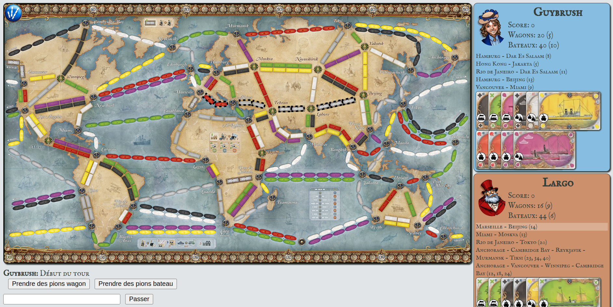

# Projet - *Aventuriers du Graphe (Autour du Monde)*

**Phase 2 : _mise en œuvre des algorithmes de graphes afin de définir des stratégies de jeu pour les joueurs et finaliser le calcul des scores_**
* **Période (prévisionnelle) :** 17 avril - mi-mai 2023 (la date de rendu du code sera fixée ultérieurement)
* **Cours concerné** : _Graphes_
* **Enseignants :**
  [Alexandre Bazin](mailto:alexandre.bazin@umontpellier.fr),
  [Irène Larramendy](mailto:irene.larramendy-valverde@umontpellier.fr),
  [Alain Marie-Jeanne](mailto:alain.marie-jeanne@umontpellier.fr)

Ce projet est la suite de la [Phase 1 du projet _Aventuriers du Rail Autour du Monde_](https://gitlabinfo.iutmontp.univ-montp2.fr/dev-objets/projets/aventuriers-monde).

## Calendrier de travail
Pour vous aider à démarrer et faire la transition depuis la [Phase 1 du projet _Aventuriers du Rail Autour du Monde_](https://gitlabinfo.iutmontp.univ-montp2.fr/dev-objets/projets/aventuriers-monde), durant la semaine 17-21 avril 2023, deux séances de TD du module [Dev-Objets](https://gitlabinfo.iutmontp.univ-montp2.fr/dev-objets) seront consacrées à :
* l'explication du code de la correction de la Phase 1
* la présentation du paquetage `fr.umontpellier.iut.graphes` et son lien avec le reste du code du jeu.

Quelques fonctions élémentaires de graphes seront implémentées durant ces séances de Dev-Objets et vous pourrez commencer à travailler en autonomie.

Après les vacances de Pâques, des séances SAE supplémentaires seront affectées dans le cadre du cours sur les Graphes pour vous aider dans vos choix algorithmiques.

## Objectifs
Dans cette *Phase 2* de la SAÉ, nous vous proposons de programmer des algorithmes de base de la théorie des graphes. Certains de ces algorithmes devraient permettre d'en construire des plus complexes relatifs au jeu. Par exemple :
* étant donné les routes disponibles, est-ce qu'une Destination est réalisable par le joueur ?
* étant donné le nombre de pions wagons/bateaux restants, est-ce qu'une Destination est réalisable par le joueur ?
* est-ce qu'une _Destination Itinéraire_ est réalisée entièrement (à savoir, il existe un parcours des villes dans l'ordre et sans repasser par la même ville) ?
* etc.

[//]: # (Voici le [sujet détaillé]&#40;documents/SAEbis.pdf&#41;.)
La plupart des algorithmes qui vous seront proposés seront présentés "mathématiquement" dans le cours sur les graphes.

Les graphes issus du jeu _Les Aventuriers du Rail Autour du Monde_ sont légèrement différents de ceux vus en cours : chaque arête dispose d'un objet `Route` correspondant. On peut voir cette donnée comme une étiquette de l'arête. Une classe `Arete` correspondant à cette spécification vous êtes donc donnée dans le paquetage `fr.umontpellier.iut.graphes`. Pour les algorithmes de base, les extrémités de l'arête sont suffisantes, mais comme ces algorithmes seront à utiliser pour les algorithmes relatifs au jeu, il faudra dès le départ les intégrer dans la classe `Arete`.
Les sommets seront par défaut des entiers de 0 à n-1. Les extrémités d'une arête seront donc deux entiers (l'ordre sur ces entiers n'a pas d'importance pour un graphe non orienté).

**Remarque :** les graphes modélisés ici peuvent avoir des multi-arêtes (dans le plateau du jeu, il y a des situations où deux villes sont connectées par 2 routes de même longueur et couleur...).

## Travail à réaliser

Un objet de la classe `Graphe` pourra être construit de plusieurs façons :
* à partir d'une collection d'objets `Arete` (le graphe induit par ces arêtes) ;
* à partir de l'ordre `n` du graphe (dans ce cas, il s'agit d'un graphe avec comme sommets des entiers entre `0` et `n-1` et sans arêtes) ;
* à partir d'un objet `Graphe graphe` et un sous-ensemble de sommets `X` de `g`, le sous-graphe induit par `X` dans `g`.

On pourra avec ce modèle construire à partir du jeu des objets de type `Graphe`. Pour cela, vous allez compléter les fonctions `getGraphe()` et `getGraphe(Collection<Route> ensembleDeRoutes)` de la classe `Plateau`. Ainsi, il sera possible d'extraire le graphe représentant la situation complète du jeu, ou uniquement le graphe ne contenant que les arêtes d'un joueur, ou celui contenant les arêtes d'un joueur et les arêtes non occupées (pour savoir si une mission est réalisable), ....

Voici une liste des méthodes de la classe `Graphe` que nous vous demandons de programmer dans un premier temps :

1. Renvoyer le degré d'un sommet (un entier).
2. Renvoyer le voisinage d'un sommet sous la forme d'un ensemble d'entiers.
3. Créer un sous-graphe induit par un sous-ensemble de sommets.
4. Déterminer si le graphe est complet.
5. Déterminer si le graphe est une chaîne.
6. Déterminer si le graphe est un cycle.
7. Savoir si le graphe a des cycles.
8. Déterminer si une séquence donnée (liste d'entiers) est celle d'un graphe.
9. Déterminer si deux graphes sont isomorphes.
10. Renvoyer la classe de connexité d'un sommet (sous la forme d'un ensemble d'entiers).
11. Renvoyer l'ensemble des classes de connexité du graphe.
12. Déterminer si deux sommets sont voisins.
13. Déterminer si une arête est un isthme.
14. Déterminer si le graphe est un arbre/forêt.
15. Fusionner deux sommets (en supprimant les arêtes entre eux).
16. Programmer l'algorithme de Dijkstra qui renvoie la distance minimale entre deux sommets donnés ainsi qu'un parcours réalisant cette distance (sous la forme d'une liste d'entiers, où le premier entier est le sommet de départ et le dernier le sommet d'arrivée).
17. Déterminer un plus court ensemble de routes (en nombre total de pions utilisés) que le joueur peut capturer pour compléter une
    destination (méthode `routesPourCompleterDestination(Destination d)` de la classe `Joueur`). Cette méthode ne tient pas compte de la quantité des pions dont le joueur dispose.
18. Déterminer un plus court ensemble de routes (en nombre total de pions utilisés) que le joueur peut capturer pour compléter une destination en utilisant les pions dont le joueur dispose (méthode `routesPourCompleterDestinationAvecPions(Destination d)` de la classe `Joueur`).
19. Déterminer s'il existe un parcours sans répétition de sommets passant par une liste donnée de villes (utile pour les cartes _Destination Itinéraire_).

**Questions bonus :**

20. Étant donné un joueur et deux villes (correspondant à deux sommets dans le graphe), déterminer le plus petit ensemble _bloquant_ de routes. Un ensemble est bloquant si le joueur ne peut pas relier les deux villes sans utiliser une de ces routes.
21. **Grand bonus (compliquée à réaliser) :** En fonction des cartes transport dans la main du joueur, déterminer un ensemble de routes que le joueur peut capturer :
* Pour compléter une destination (si vous pouvez minimiser la longueur totale des routes à capturer, c'est super !) ;
* ou pour maximiser la somme des points donnés par les routes capturées.

Dans les questions bonus ci-dessus, si vous pouvez tenir compte des pions wagon et bateau du joueur, c'est encore mieux !

**D'autres fonctions vous seront demandées ultérieurement dans le cadre du projet. Pensez à consulter régulièrement le [FAQ](https://gitlabinfo.iutmontp.univ-montp2.fr/graphes/aventuriers-du-graphe-autour-monde/-/blob/master/FAQ.md). Vous serez informés s'il y a des nouveautés (surveillez le [Forum Piazza](https://piazza.com/class/ld2tzi5k82via)).**

### Concernant les tests
Quelques tests publics vous sont fournis dans la classe `GrapheTest` du répertoire de test (paquetage `fr.umontpellier.iut.graphes`). Vous pouvez les utiliser pour vous aider à démarrer. Comme d'habitude, vous devriez écrire beaucoup de tests unitaires pour vérifier la bonne implémentation de vos algorithmes.

Pensez à tester les méthodes de base ci-dessus sur les graphes particuliers suivants (liste non-exhaustive) :

* une chaîne d'ordre 10 ;
* un cycle d'ordre 10 ;
* un graphe complet d'ordre 10 ;
* un graphe complet d'ordre 20 ;
* un arbre d'ordre 10 ayant au moins 4 feuilles ;
* un graphe non connexe avec 4 sommets isolés et 2 composantes d'ordre minimum 3 ;

[//]: # (* Tester la méthode statique &#40;n°8&#41; sur les séquences avec:)

[//]: # (    * &#40;1,1,2,2,2,2,2&#41;;)

[//]: # (    * &#40;1,1,2,2,2,2,2,3,3,4,4,5&#41;;)

[//]: # (    * &#40;1,1,2,2,2,2,2,3,3,3,4,4,5&#41;;)

[//]: # (    * &#40;0,0,1,1,2,2,2,2,2,3,3,3,4,4,5&#41;;)

[//]: # (    )
[//]: # (* )

**Pour des questions :**
* Le forum [Piazza](https://piazza.com/class/ld2tzi5k82via) - à privilégier lorsque vous avez des questions sur le projet. Il s'agit du même forum que pour le cours de Dev Objets (et que vous avez utilisé pour la Phase 1).
* [Email](mailto:alain.marie-jeanne@umontpellier.fr) pour une question d'ordre privée concernant le projet.

## Architecture du code

Le code qui vous est fourni contient la correction du projet correspondant à la [Phase 1 du projet _Aventuriers du Rail Autour du Monde_](https://gitlabinfo.iutmontp.univ-montp2.fr/dev-objets/projets/aventuriers-monde). La mécanique du jeu est restée intacte dans le paquetage `fr.umontpellier.iut.rails`. Quelques nouvelles fonctions à compléter ou à réécrire ont été ajoutées dans les classes `Plateau` et `Joueur` :
* `getGraphe()` et `getGraphe(Collection<Route> ensembleDeRoutes)` dans la classe `Plateau`
* `routesPourCompleterDestination(Destination d)` et `routesPourCompleterDestinationAvecPions(Destination d)` dans la classe `Joueur`
* `destinationEstComplete(Destination d)` dans la classe `Joueur`

Pour rendre le projet plus ludique, une fonctionnalité supplémentaire a été intégrée dans l'interface graphique du jeu : en survolant une destination du joueur courant, le programme devra afficher le chemin le plus cours qui permet de la réaliser. Voici un exemple :

Dans la capture d'écran ci-dessus, le joueur courant est _Largo_ et la destination survolée est _Marseille-Beijing_ (surligné en blanc dans l'image). Le chemin le plus court correspondant est balisé avec un contour noir sur le plateau du jeu et il passe par _Athina_, _Tehran_ et _Lahore_. **Mais attention**, pour que ça marche, il faudrait que vous implémentiez la méthode `routesEnSurbrillancePourDestination(Destination d)` de la classe `Joueur` qui retourne une collection de routes. Cette collection indiquera quelles routes sont à surligner quand le curseur de la souris passe sur le nom d'une destination. Par exemple, une fois que vous réaliserez les fonctions `routesPourCompleterDestination(Destination d)` et `routesPourCompleterDestinationAvecPions(Destination d)` de la classe `Joueur`, vous pouvez les appeler dans `routesEnSurbrillancePourDestination(Destination d)` afin de les afficher en surbrillance.

Les autres méthodes à implémenter, comme d'habitude, sont celles qui lèvent des exceptions de type `RuntimeException` avec le message `"Méthode non implémentée !"`. La plupart, se trouvent dans la classe `Graphe` du paquetage `fr.umontpellier.iut.graphes`.

## Évaluation

L'évaluation du projet se fera, pour 40% de la note, à l'aide de tests unitaires automatisés. Un premier jeu de tests vous est fourni (comme d'habitude dans le répertoire `src/test/java`) pour que vous puissiez vérifier le bon fonctionnement des fonctionnalités de base. Puis, nous utiliserons un second jeu de tests (secret) pour l'évaluation finale.

Il est donc attendu que vous écriviez beaucoup de tests unitaires pour vérifier par vous-mêmes que le projet se comporte correctement dans les différents cas particuliers qui peuvent se produire.

**Remarque importante** : puisque l'évaluation des rendus se fait par des tests automatisés, **les projets qui ne compilent pas ou qui ne respectent pas les signatures données, seront automatiquement rejetés** et la note sera 0.

Le reste de l'évaluation (60%) se fera par une interrogation écrite individuelle qui mesurera votre implication réelle dans le projet.

## Remarque concernant les Phases 2 et 3 du projet

Comme indiqué précédemment, cette phase (Phase 2) se déroule en parallèle de la Phase 3, où vous devez programmer une interface graphique sous JavaFX. La Phase 3 démarrera au mois de mai et est complètement indépendante de la Phase 2. Il est important que les projets GitLab des Phases 2 et 3 restent distincts.

Lorsque vos différentes fonctions de calculs utilisant les graphes marcheront, vous pourrez (si vous le souhaitez), ajouter le code correspondant dans votre projet JavaFX (de la Phase 3). **Nous vous déconseillons fortement de le faire avant la fin de la Phase 2 !**   
